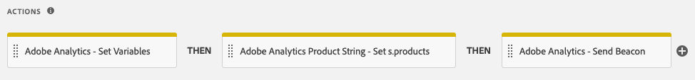

# Adobe Analytics Product String Launch Extension

The products variable tracks how users interact with products on your site. For instance, the products variable can track how many times a product is viewed, added to the shopping cart, checked out, and purchased. It can also track the relative effectiveness of merchandising categories on your site.

The products variable should always be set in conjunction with a success event.

The Adobe Analytics Product String Builder extension automatically sets the products variable for you by looping through your data layer, grabbing all the necessary product related data, and formatting it in the proper syntax shown below. You no longer need to write and maintain custom JavaScript to perform these complex actions!

## Syntax of the Products Variable

```bash
Category;Product;Quantity;Price;eventN=X|eventN2=X2;eVarN=merch_category|eVarN2=merch_category2
```

For complete documentation, please visit [Products](https://docs.adobe.com/content/help/en/analytics/components/variables/dimensions-reports/reports-products.html)

## Extension Instructions

**Action Configuration**:

To use this extension, simply add the "Adobe Analytics Product String - Set s.products" action to your rule.


**Setting the Standard Product Data**:

The next step is to define your data layer variables. Once you configure the action as outlined in the previous step, you'll be presented with the screen below.


For each of the data points you want to include in the product string, simply enter the path to the appropriate data layer variable.

For example, if your data layer is structured like this:

```json
digitalData = {
  "transaction": {
    "item": [{
      "productInfo": {
        "productName": "My Product"
      }
    }]
  }
};
```

You would enter the following path in the "Variable for product ID/name" field to capture the productName variable:

```json
digitalData.transaction.item.productInfo.productName
```

**Please Note:** If you're using a data element to populate the field, it should be configured using the "Constant" or "Custom Code" data element type and must return the path above as a string literal.

**Price Type**

The "price" parameter in the Adobe Analytics product string must reflect the total price for the number of units purchased, not the unit price, for that product. When enabling the "price" field in the extension action you must specify whether your data layer exposes the total price or unit price. When using the unit price, the Adobe Analytics Product String extension will automatically multiply the unit price by the quantity to get the total price and set the product string properly.


**Custom Events &amp; Merchandising eVars**:


If your implementation uses custom events or merchandising eVars, follow these steps:

- Click the associated "Add" button.
- Choose the event or eVar you need to set from the dropdown.
- Enter the path to the appropriate data layer variable using the same syntax described in step 2 above.

**Action Sequence**:

This action must be accompanied by an "Adobe Analytics - Set Variables" action that sets the corresponding success event(s), as well as an "Adobe Analytics - Send Beacon" action. The proper sequence of actions is illustrated below.



**Requirements**:

- An object based [data layer](https://theblog.adobe.com/data-layers-buzzword-best-practice/) with variables for all product related data (i.e. product ID, quantity, price). This extension will not work with array based data layers.
- The [Adobe Analytics](https://docs.adobe.com/content/help/en/launch/using/extensions-ref/adobe-extension/analytics-extension/overview.html) extension must be installed.
